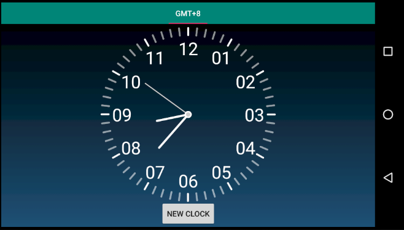

## 浙江大学安卓开发小学期 作业4

> 姓名：朱璟森
>
> 学号：3170104166
>
> 专业：计算机科学与技术

****

### 作业要求

创建一个Android app工程，实现

* 绘制时钟界面，包括表盘、时针、分针、秒针
* 时针、分针、秒针需要跳动
* 有表盘模式和数字模式，点击页面切换
* 支持横竖屏切换

### 作业实现

作业实现的主界面如下：

具体功能实现为：

#### 时钟界面的绘制

`onDraw`中的绘制逻辑为：绘制表盘边缘->绘制数字->绘制时针分针秒针->绘制中心，其中绘制表盘边缘已经实现

* 绘制数字

  本次实现中，每个数字的中心位于以0.75倍表盘半径的圆上，通过数字对应的角度，用三角函数计算其中心的坐标值，再将中心的Y坐标通过`FontMetrics`换算为Baseline的坐标，然后就可以调用`drawText`函数进行绘制。

* 绘制时针分针秒针

  首先要通过`Calendar`获取到当前的时间，然后就可以计算时针、分针、秒针的旋转度数：

  * 秒针度数 = 6° * 秒
  * 分针度数 = 6° * (分 + 秒/60)
  * 时针度数 = 30° * (时 + 分/60 + 秒/3600)

  然后通过三角函数运算就可以得到时针、分针、秒针末端的坐标，时针、分针、秒针长度分别为0.36、0.5、0.6倍表盘半径。通过设置`StrokeCap`达到圆润效果。

* 绘制中心

  绘制中心只需绘制两个圆，第一个设置为`FILL`填充内心，第二个设置为`STROKE`填充外圈。

#### 时钟的跳动

本次作业通过`ScheduledExecutorService`定时线程池，设置定时间隔为1秒，每秒钟向`Handler`发送message，`Handler`接收到后就会在主线程内调用`invalidate`函数对时钟界面进行刷新。

为了防止`Handler`造成的内存泄漏，我们将其设置为静态类，这样`Handler`就不会持有外部`Fragment`导致其无法被回收。我们通过维护一个`Fragment`的弱引用来对界面进行刷新，弱引用并不会影响到`Java`的垃圾回收机制，因此不会内存泄漏。

另外，我们在`onStop`中将线程池`shutdown`，这样线程就能够在程序退出后被回收。

#### 表盘模式和数字模式

其功能已经在demo中实现，通过维持一个`mShowAnalog`的布尔变量来实现。截图为：

#### 支持横竖屏切换

截图：

### 扩展功能：世界时钟

点击下方的按钮"NEW CLOCK"，就会弹出一个对话框要求填写时区，以格林威治标准时间 (GMT) 为准，时差范围为-12至+12小时，其中北京时间为+8 (东八区)。如下图：

填写"0"，上方的`TabLayout`就会新增一个新标签页，其时间为格林威治标准时间：

每个标签页都独立地支持点击切换数字/表盘的操作，因为每个标签页都由独立的`Fragment`组成。在绘制事件中对`Calendar`设置时区来达到国际时钟的目的。

### 总结与心得

本次作业中，实现了自定义`View`的绘制时间，主要难点在于三角函数在坐标转换中的应用，以及创建线程来定时刷新页面，还要及时回收线程并防止内存泄漏。扩展功能的实现复习了昨天关于`Fragment`的知识，实现时区转换也是安卓应用走向国际化必不可少的一部分。